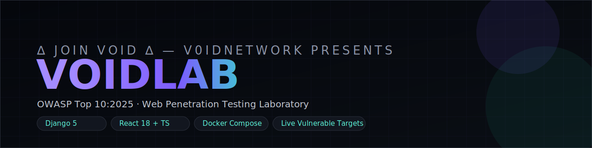

<p align="center">
  
</p>

<h3 align="center">A self-hosted, containerized web penetration testing training range.</h3>
<p align="center">
  Live vulnerable targets · a sandboxed in-browser terminal · flag-based scoring · a real OWASP Top 10:2025 curriculum.
</p>

<p align="center">
  <a href="#quick-start">Quick Start</a> ·
  <a href="#features">Features</a> ·
  <a href="#owasp-top-102025-coverage">OWASP Coverage</a> ·
  <a href="#architecture">Architecture</a> ·
  <a href="#extending-the-lab-catalog">Extending</a> ·
  <a href="#credits">Credits</a>
</p>

---

## What is VOIDLAB?

VOIDLAB is a modular, Dockerized penetration-testing lab you run yourself: a Django 5 / DRF
backend, a React 18 + TypeScript frontend, and a set of genuinely vulnerable, isolated
containers to attack — wired together with an authenticated flag-submission workflow, a
points/leaderboard system, hint economy, and an in-browser sandboxed terminal.

It's built around the **current OWASP Top 10:2025** list (OWASP refreshed the Top 10 in late
2025 — this project tracks that update rather than the older 2021 edition), with 21 hand-written
labs spanning all ten categories. Five labs run against **live, disposable, non-privileged
containers** (SQL injection, reflected XSS, OS command injection, IDOR/BFLA, and SSRF); the
remaining labs are realistic **analysis challenges** — a genuine artifact (vulnerable code
snippet, log excerpt, encoded config) embedded in the briefing, in the same spirit as
jeopardy-style CTF "misc/crypto/forensics" categories. See [Extending the lab
catalog](#extending-the-lab-catalog) for how to turn any of those into a live target, and how to
grow the catalog past 30 labs using the exact same pattern.

## Features

- 🔐 **JWT authentication & profiles** — register, log in, track points and labs completed.
- 🧪 **21 structured labs** across all ten OWASP Top 10:2025 categories, easy → insane.
- 🎯 **5 live, isolated vulnerable-app containers** (SQLi, XSS, Command Injection, IDOR/BFLA, SSRF), each its own non-root, capability-dropped Docker service.
- 🖥️ **Sandboxed in-browser terminal** over WebSocket, proxying an allowlisted recon toolkit into an isolated, non-privileged `attacker-box` container — enforced server-side, twice over, never a raw shell.
- 🚩 **Flag submission** with idempotent scoring, per-hint point penalties, and a full attempt/audit trail.
- 💡 **Tiered hints** that cost points, plus **admin/instructor-only full solutions** — gated server-side by role, not just hidden in the UI.
- 🏆 **Live leaderboard**, cached briefly for snappy polling.
- 🎨 **Dark, cyberpunk-inspired UI** — Tailwind v4 + a hand-built shadcn-style component set, Chakra Petch/Inter/JetBrains Mono type system, a 4-color semantic signal palette (violet/cyan/amber/crimson) instead of one flat neon accent.
- 🐳 **One-command Docker Compose stack**: frontend, backend, Postgres, Redis, attacker-box, and every vulnerable-app target.

## OWASP Top 10:2025 coverage

| Code | Category | Labs |
|------|----------|------|
| A01 | Broken Access Control (now includes IDOR & SSRF) | Profile Peeper (IDOR) · Admin By Accident (BFLA) · Metadata Reach (SSRF) |
| A02 | Security Misconfiguration | Debug Left On · Bucket Left Open |
| A03 | Software Supply Chain Failures | Typosquat Trap · Unsigned Update |
| A04 | Cryptographic Failures | Weak Hash Cracker · None Alg JWT |
| A05 | Injection | SQL Injection: Login Bypass · Reflected XSS: Cookie Heist · OS Command Injection |
| A06 | Insecure Design | Negative Quantity · No Rate Limit, No Problem |
| A07 | Authentication Failures | Session Fixation · Brute-Forceable Login |
| A08 | Software or Data Integrity Failures | Insecure Deserialization · Tampered Update, Take Two |
| A09 | Security Logging and Alerting Failures | Silent Intruder |
| A10 | Mishandling of Exceptional Conditions (new for 2025) | Fail Open · Race Condition Redeem |

Run `python manage.py seed_labs` (done automatically on container start) to load the full
catalog with hints and solutions.

## Quick start

**Prerequisites:** Docker + Docker Compose. Nothing else needs to be installed locally.

```bash
git clone <this-repo-url> voidlab
cd voidlab
cp .env.example .env      # edit secrets/passwords before any real deployment
docker-compose up --build
```

Then open:

| Service | URL |
|---|---|
| Frontend | http://localhost:5173 |
| Backend API | http://localhost:8000/api/v1/ |
| API docs (Swagger) | http://localhost:8000/api/v1/docs/ |
| Django admin | http://localhost:8000/admin/ |
| sqli-lab target | http://localhost:8081 |
| xss-lab target | http://localhost:8082 |
| cmdi-lab target | http://localhost:8083 |
| idor-lab target | http://localhost:8084 |
| ssrf-lab target | http://localhost:8085 |

On first boot the backend container automatically runs migrations, seeds the OWASP category +
lab catalog, and (if `DJANGO_SUPERUSER_USERNAME`/`DJANGO_SUPERUSER_PASSWORD` are set in `.env`)
creates an admin account you can use to view hint/solution content and the Django admin.

> **Note on migrations:** this repo generates Django migrations at container startup
> (`python manage.py makemigrations` runs before `migrate` in `backend/entrypoint.sh`) rather
> than shipping pre-committed migration files, since they weren't generated against a live
> Django install when this project was authored. For a real production deployment, run
> `makemigrations` once yourself, commit the resulting files, and remove that line from the
> entrypoint so schema changes are explicit and reviewable like any other code change.

## Architecture

```
voidlab/
├── docker-compose.yml        # orchestrates every service below
├── .env.example
├── backend/                  # Django 5 + DRF + Channels
│   ├── config/                #   settings, URLs, ASGI (HTTP + WebSocket)
│   └── apps/
│       ├── core/               #   health check, request-ID middleware, JWT-for-WS auth
│       ├── accounts/            #   custom user model, JWT auth, profile
│       ├── labs/                #   categories, labs, hints, solutions, submissions, scoring
│       ├── leaderboard/          #   cached global ranking
│       └── terminal/             #   WebSocket consumer → attacker-box proxy
├── frontend/                 # React 18 + TS + Vite + Tailwind v4 + Zustand
│   └── src/
│       ├── components/ui/       #   hand-built shadcn-style primitives
│       ├── components/layout/    #   navbar, auth guard
│       ├── store/                #   auth + labs zustand stores
│       └── pages/                #   landing, auth, dashboard, labs, terminal, leaderboard
├── attacker-box/              # isolated, non-root command-runner behind the terminal
├── vulnerable-apps/
│   ├── sqli-lab/                #   Flask + SQLite, string-concatenated login query
│   ├── xss-lab/                  #   Flask, reflected/unescaped search + local cookie collector
│   ├── cmdi-lab/                  #   Flask, os.popen() ping tool
│   ├── idor-lab/                   #   Flask, IDOR + BFLA in one app
│   └── ssrf-lab/                    #   Flask, server-side fetch + loopback metadata service
└── docs/
```

### Network segmentation

Two Docker networks: `voidlab_core` (frontend, backend, Postgres, Redis) and `voidlab_targets`
(attacker-box + every vulnerable-app container). The backend joins both, but **only** to reach
`attacker-box` for the terminal proxy — it never runs `subprocess`/`os.system` against a target
itself and never mounts the Docker socket. Every lab/attacker-box container runs as a non-root
user with `cap_drop: [ALL]` (plus a narrow, explicit `cap_add` only where a tool genuinely needs
it, e.g. `NET_RAW` for `ping` in `cmdi-lab`).

### The sandboxed terminal, honestly

The in-browser terminal is a real, working feature — not a simulation — but it is scoped
deliberately: it proxies a **fixed allowlist** of read-only recon tools (`curl`, `nmap`, `dig`,
`whoami`, `id`, `ls`, `cat`, `pwd`, `echo`, `nslookup`, `sqlmap`, `nikto`) into the isolated
`attacker-box` container, enforced independently in **two** places (the Django consumer and the
exec server itself), with a hard per-command timeout and output cap. It is appropriate for a
**self-hosted** training lab you run yourself. It is **not** hardened for exposing to the public
internet as a multi-tenant SaaS — that would need a fresh, ephemeral, per-session sandbox (e.g.
gVisor or Firecracker microVMs) instead of one shared `attacker-box`, which is a meaningful next
step, not a checkbox.

## Extending the lab catalog

Every lab lives as one entry in `backend/apps/labs/management/commands/seed_labs.py`'s
`LAB_CATALOG` list. To add a new lab:

1. Add a new dict to `LAB_CATALOG` — `cat` (category code), `title`, `difficulty`, `points`,
   `summary`, `briefing`, `objective`, `flag`, `hints`, `solution`, and either a `target_app` +
   `target_path` (if it targets a live container) or leave those blank for a self-contained
   analysis challenge.
2. Re-run `python manage.py seed_labs` (idempotent — safe to re-run any time).
3. If it needs a **new live container**: copy the shape of any folder under `vulnerable-apps/`,
   add it as a service to `docker-compose.yml` on the `voidlab_targets` network, add its URL to
   `VULNERABLE_APP_URLS` in `backend/config/settings.py`, and point `target_app` at its key.

This repository ships 21 labs; the pattern above is identical for lab #22 through #30+.

## Tech stack

**Frontend:** React 18, TypeScript, Vite, Tailwind CSS v4, hand-built shadcn-style components, React Router 6, Zustand, Axios, lucide-react, react-markdown.
**Backend:** Django 5.2 LTS, Django REST Framework, SimpleJWT, Django Channels (WebSocket), drf-spectacular (OpenAPI docs), PostgreSQL 16, Redis 7.
**Infra:** Docker, Docker Compose, nginx (frontend static serving), Daphne (ASGI server).

## Screenshots

> _Placeholders — replace with real screenshots once you've run the stack locally._

| Landing | Lab catalog | Lab detail | Terminal |
|---|---|---|---|
| `docs/screenshots/landing.png` | `docs/screenshots/labs.png` | `docs/screenshots/lab-detail.png` | `docs/screenshots/terminal.png` |

## Honest scope notes

This is a real, working platform, not a mockup — but it's worth being precise about what
"working" means here:

- 5 of the 21 labs run against **live** containers you can actually attack end-to-end; the rest
  are analysis-style challenges (see above) rather than live-exploitable services.
- Migrations are generated at container start rather than committed (see the note under [Quick
  start](#quick-start)) — fine for spinning the stack up, not a substitute for committed
  migrations in a real deployment.
- The terminal's sandboxing is real but scoped to a **self-hosted, single-tenant** use case; see
  [Architecture](#architecture) for what a public multi-tenant version would additionally need.

## Credits

Built by **V0IDNETWORK** — an open research effort on Internet circumvention & surveillance technologies.

- GitHub: [voidNetwork](https://github.com/voidNetwork)
- LinkedIn / Instagram / YouTube: **voidNetwork**
- TryHackMe: **V0IDNETWORK**
- Contact: +989928102005 · [ilianothingg@gmail.com](mailto:ilianothingg@gmail.com)

<p align="center"><b>∆ Join VOID ∆</b></p>
